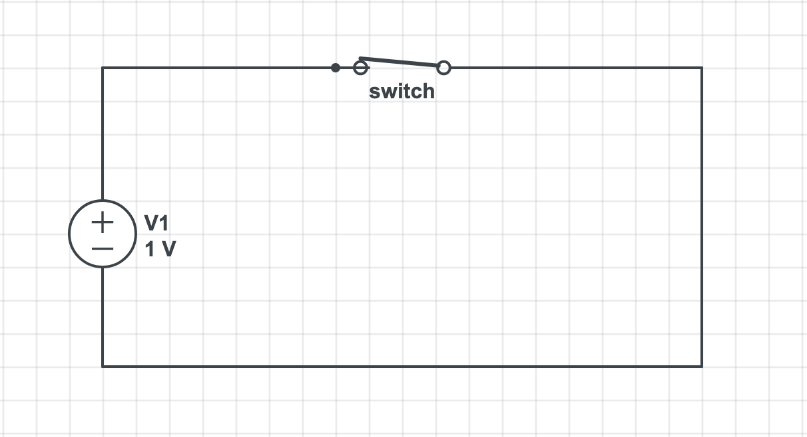

# Cutout

[](https://travis-ci.org/Anondo/cutout)
[](LICENSE)
[](https://github.com/Anondo/cutout/releases)
[](https://godoc.org/github.com/Anondo/cutout)


Cutout is a package implementing the circuit breaker design pattern for consuming third-party apis. First a
bit about the circuit breaker design pattern

### Circuit Breaker
Imagine a very simple circuit like this one:


Here, the switch is evidently closed, so it is safe to say that the circuit is a **CLOSED** one. Meaning, electricity is gonna flow
through the circuit. Or circuit is working fine. So whenever there is a mishap, like excessive voltage or whatever(not that into
electrical stuffs), the switch opens up(the circuit breaker does that), stoping the circuit from being a whole and thus, stopping the electricity flow causing the circuit to pause. So at this point, we can call the circuit an **OPEN** one. Like this:


Enough of electricity, now into the beautiful software world. So whenever your piece of software is consuming an api, it is natural
for the service you are trying to call to fail. So you keep calling it , it keeps failing, eventually its gonna cost you a lot of
resource consumption, failures etc. Comes the circuit breaker design pattern. This design pattern, like the electrical example i've
provided has three(yes , one extra) states:

**CLOSED STATE**: In this state, the service you are trying to consume is working fine, sending you responses in your desired time and all. This is the initial state.

**OPEN STATE**: After the service you are consuming fails upto a certain threshold you've provided, the **fail_threshold** which is a part of the circuit breaker, the circuit breaker reaches the ``open`` state. So instead of calling the service, the circuit breaker now goes for the fallback methods you've provided to get the responses, and to keep the work flow intact. Now, what if the service comes back on?!

**HALF-OPEN STATE**: So your circuit breaker is in the ``open`` state , serving the fallbacks, now to check if the service is back alive, the circuit breaker changes its state and calls the service once to check if its alive after a certain period, the **health check period**(another part of the circuit breaker). If the service is back on, the state changes to ``closed`` and does what the ciruit does in the closed state and if not, it changes back to the ``open`` state serving the fallbacks.

For more details, see https://martinfowler.com/bliki/CircuitBreaker.html


### So, Cutout

Cutout follows the circuit breaker design pattern and helps you call your services in a safer way.
Cutout comes with additional features like:

1. Multilevel fallback functions(in case even the fallback fails)
1. Custom BackOff function on the request level for generating backoff timeout logics
1. Event channel to capture events like State change or failure detection
1. Get analytical data on the circuit breaker

### Installing
```console
go get -u github.com/Anondo/cutout

```

### Usage

**Import The Package**

```go
import "github.com/Anondo/cutout"

```

**Initiate the circuit breaker and request instances**

```go
 var (
	 cb = &cutout.CircuitBreaker{
	  	FailThreshold:     100,
	  	HealthCheckPeriod: 15 * time.Second,
	 }
	 req = cutout.Request{
	  	URL:           "http://localhost:9090",
	  	AllowedStatus: []int{http.StatusOK},
	  	Method:        http.MethodPost,
	  	TimeOut:       2 * time.Second,
	  	RequestBody:   bytes.NewBuffer([]byte(`{"name":"abcd"}`)),
	  	BackOff: func(t time.Duration) time.Duration {
		    return time.Duration(int(t/time.Second)*5) * time.Second
	      },
	 }

 )

```

**Prepare a fallback function**
```go

func() theFallbackFunc(*cutout.Response, error) {
  // some fallback codes here...

  return &cutout.Response{
    BodyString: cachedResponse,
  }, nil

}

```

**Call a third party service from your handler**

```go

func thehandler(w http.ResponseWriter, r *http.Request) {

	resp, err := cb.Call(&req, theFallbackFunc)

	if err != nil {
		fmt.Fprint(w, err.Error())
		return
	}

	w.WriteHeader(http.StatusOK)
	fmt.Fprint(w, resp.BodyString)
}

```

For more details, see the [docs](https://godoc.org/github.com/Anondo/cutout) and [examples](examples/).


### Contributing

Totally open to suggestions. See the contributions guide [here](CONTRIBUTING.md).

### License

Cutout is licensed under the [MIT License](LICENSE).
